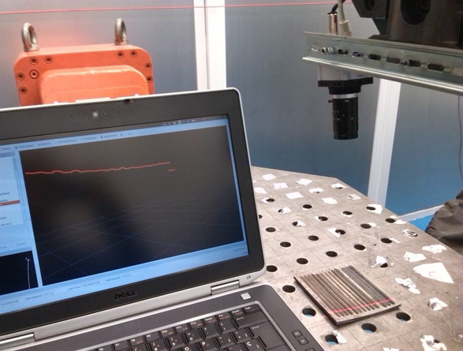

# Proper

Vision guided 3D Direct Laser Repair of Complex Metal Parts.

## Contents

This meta-package contains two packages:
- proper_workcell: contains the working cell description files.
- proper_cloud: contains some useful tools used for 3D filtering (under development).

## Description

The 3D monitoring system uses the [Etna Project](https://github.com/jraraujo-aimen/etna)
implementation to provide an on-line scanning solution based on the triangulation
principle integrated with the laser head.

A 2D camera, a laser stripe, and the coupling element are only the hardware components
required to perform the scanning functions based on triangulation. To improve the
overall performance of the solution a NIR camera from IDS is used, because the sensor
of this camera provides an improved sensitivity (about 60%) in the range of the laser
wavelength (660nm). This sensitivity is a key factor to minimize the exposition time,
reducing the distortion error caused by the movement in the image.

This solution provides the calibrated geometrical information in robot working coordinates,
allowing the scanning and dimensional control of the piece. The laser line is detected
in the image and transformed to 3D coordinates in the camera frame. Finally, the point
cloud is resolved on-line in the working cell coordinates with independence of the process
speed and the robot path trajectory.



*3D profile in the robot working coordinates from a piece with multiple single tracks.*

Robot working coordinates monitoring is the key piece for the dimensional control of
the 3D manufacturing system. Moreover, this solution allows to obtain directly the 3D
scanning of the part in its position inside the working cell in its real dimensions.

## 3D Scan


To record a bag file with the scanning information:

```
roslaunch proper_workcell proper_workcell.launch
roslaunch proper_workcell proper_bagrecord.launch filename:=scan.bag
```

To play a bag file with the scanning information:

```
roslaunch proper_workcell proper_bagplay.launch filename:=scan.bag
```

To convert a bag file with the scanning information to a point cloud in xyz format:

```shell
roscore
rosrun proper_cloud sub_cloud.py
roslaunch proper_workcell proper_bagplay.launch filename:=scan.bag
```

## Acknowledgement

This work is been supported by the European Commission through the research project
"Laser equipment ASsessment for High impAct innovation in the manufactuRing European
industry (LASHARE)", FP7-2013-NMP-ICT-FOF - Grant Agreement Nº 609046.

[http://www.lashare.eu/](http://www.lashare.eu/http://www.lashare.eu/)
