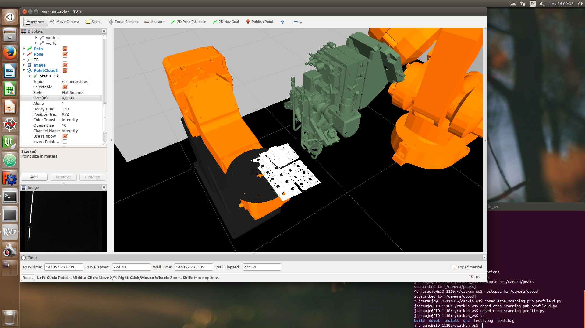

# Proper

Vision guided 3D Direct Laser Repair of Complex Metal Parts.

## Introduction

Laser Metal Deposition (LMD) is a promising additive-manufacturing technique
for repair or fabrication of near-net-shape (i.e. close to the designed final
shape) metal components. Parts are built up layer-by-layer directly from a 3D
CAD model, through the successive deposition of partially overlapped clad
tracks. A laser beam is used to melt the powder particles injected on the
surface of the component while is moved along the tracks path. This is based on
the traditional laser cladding process, which is widely used in industry for
coating and repair of critical parts like turbine blades and stamping molds.

The complexity of laser cladding makes a challenge to adequate the process
parameters (e.g. traverse speed, laser power, powder feed rate) to achieve an
homogeneous layer with an specific properties. In a traditional way, a set of
parameters is supposed to give constant conditions through the successive
deposition of tracks. Thus the laser path required to build up the part is calculated off-line based on a constant layer height and track width. Therefore
the final volume can be achieved assuming no distortions during the process.

Tracks are affected by heating and part geometry during the process, especially building large parts. The piece suffers from geometrical distortions and clad
defects. It is particularly affected by overheating and accumulation of
residual thermal stresses, main cause of building defects. As a consequence,
the final dimensions and properties of each manufactured part are not
guaranteed. The difficulty to get a constant operation through the successive
deposition of material becomes necessary to develop monitoring and control
tools.

In recent years, several closed-loop control systems have been proposed to
improve the laser cladding stability during the process [1]. These control
systems mainly use a coaxial arrangement for the melt pool monitoring  (i.e. temperature or width), acting on the laser power to overcome the effects of
thermal variations. However, LMD suffers from a lack of more specific
solutions beyond the melt pool monitoring and control.

Compatible with current coaxial solutions, a novel approach focused on the
on-line geometrical measurement and laser path adaptation of the LMD process
has been proposed [2]. This enables the detection and correction of geometrical  distortions to avoid the final result affectation. Besides improving the
accuracy and finishing of the near-net-shape part built from the 3D design
model. It takes special attention to the flexibility required to be exploited
on current laser cladding industrial facilities.

This 3D scanning solution for geometrical monitoring has been demonstrated that
is suited to work on-line in a robotized LMD process, able to different  configurations and conditions through a self-calibrated procedure. In this way,
the system is able to provide a point cloud in the working coordinates with no
constraints in the movement of the robot.

[1] J. Rodriguez-Araujo, J.J. Rodriguez-Andina, J. Farina, F. Vidal, J.L. Mato, M.A.
Montealegre, “Industrial Laser Cladding Systems: FPGA-Based Adaptive Control”, IEEE
Industrial Electronics Magazine, vol. 6, no. 4, pp. 35-46, Dec. 2012.

[2] J. Rodriguez-Araujo, J.J. Rodriguez-Andina, "ROS-based 3D on-line monitoring of LMD
robotized cells", 2015 IEEE 13th International Conference on Industrial Informatics (INDIN),
vol., no., pp. 308-313, 22-24 July 2015.

## Description

The 3D monitoring system uses the [Etna Project](https://github.com/jraraujo-aimen/etna)
implementation to provide an on-line scanning solution based on the
triangulation principle integrated with the laser head.

A 2D camera, a laser stripe, and the coupling element are only the hardware
components required to perform the scanning functions based on triangulation.
To improve the overall performance of the solution a NIR camera from IDS is
used, because the sensor of this camera provides an improved sensitivity (about
60%) in the range of the laser wavelength (660nm). This sensitivity is a key
factor to minimize the exposition time, reducing the distortion error caused by
the movement in the image.

This solution provides the calibrated geometrical information in robot working  
coordinates, allowing the scanning and dimensional control of the piece. The
laser line is detected in the image and transformed to 3D coordinates in the
camera frame. Finally, the point cloud is resolved on-line in the working cell  
coordinates with independence of the process speed and the robot path
trajectory.

The achieved accuracy is enough to distinguish tracks with a height lower than  0.5mm, as shown the next picture.


*3D profile in the robot working coordinates from a piece with multiple single tracks.*

Robot working coordinates monitoring is the key piece for the dimensional
control of the 3D manufacturing system. Moreover, this solution allows to
obtain directly the 3D scanning of the part in its position inside the working
cell in its real dimensions.

## Contents

This meta-package contains two packages:
- proper_workcell: contains the working cell description files.
- proper_cloud: contains some useful tools used for 3D filtering (under development).

## 3D Scan



To record a bag file with the scanning information:

```
roslaunch proper_workcell proper_workcell.launch
roslaunch proper_workcell proper_bagrecord.launch filename:=scan.bag
```

To play a bag file with the scanning information:

```
roslaunch proper_workcell proper_bagplay.launch filename:=scan.bag
```

To convert a bag file with the scanning information to a point cloud in xyz format:

```shell
roscore
rosrun proper_cloud sub_cloud.py
roslaunch proper_workcell proper_bagplay.launch filename:=scan.bag
```

## Acknowledgement

This work is been supported by the European Commission through the research project
"Laser equipment ASsessment for High impAct innovation in the manufactuRing European
industry (LASHARE)", FP7-2013-NMP-ICT-FOF - Grant Agreement Nº 609046.

[http://www.lashare.eu/](http://www.lashare.eu/)
